# TCP와 UDP

## 1. TCP란 ⭐⭐⭐

- 송신부와 수신부의 연결을 확인하는 연결형 서비스

- 패킷 교환 방식은 패킷이 전달되는 회선이 정해져 있는 가상회선방식

- 패킷의 전송 순서 보장

- 패킷의 수신 여부 확인

- 송신부와 수신부는 1대 1 통신

- 데이터의 손실이 없음을 보장하므로 신뢰성 높음

- 그대신 데이터 송수신 속도 느림

➡️ 패킷 교환 방식

- 가상회선방식

데이터를 주고받기 전에 패킷을 전송할 경로인 가상 회선을 설정해서 모든 패킷을 같은 경로로 전송

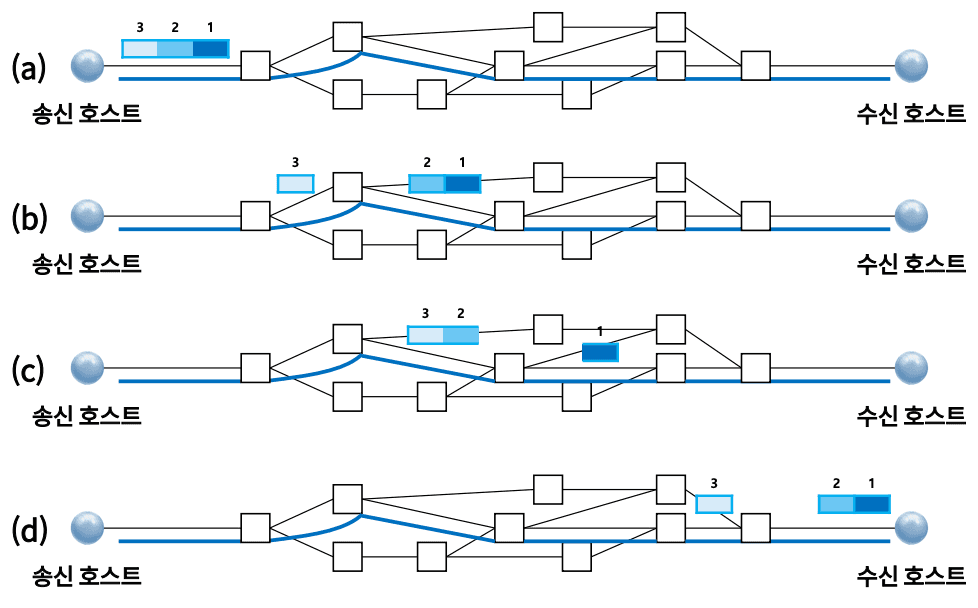

- 데이터그램방식

패킷마다 최적의 경로로 전송되는 방식, 송신부에서 보낸 패킷의 순서와 수신부에 도착하는 패킷의 순서가 다를 수 있음

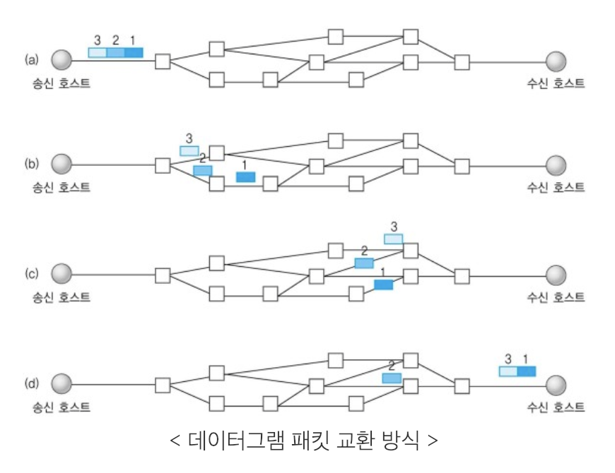

 

## 2. TCP 핸드셰이킹 ⭐⭐⭐

연결을 시작할 때는 3-way 핸드셰이킹

연결을 종료할 때는 4-way 핸드셰이킹

핸드셰이킹 과정에서는 송신부와 수신부 간 연결을 제어할 수 있도록 플래그 값 주고 받음

SYN - 동기화의 약자로, 연결을 생성할 때 사용

FIN - 종료의 약자로, 연결을 끊을 때 사용

ACK - 승인의 약자로, 데이터를 전송하면 수신자가 받았음을 알려줄 때 사용

RST - 초기화의 약자로, 연결을 재설정할 때 사용

PSH - 밀다의 약자로, 빠른 응답이 필요한 데이터를 응용 계층으로 즉시 전송할 때 사용

URG - 긴급의 약자로, 다른 데이터보다 우선순위가 높은 데이터를 전송할 때 사용

3-way 핸드셰이킹

데이터를 본격적으로 주고받기 전에 상대방 컴퓨터와 세션을 수립하는 과정
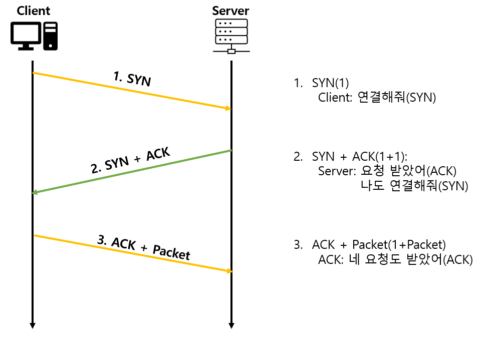

4-way 핸드셰이킹

TCP 연결을 해제할 때 이뤄지는 과정
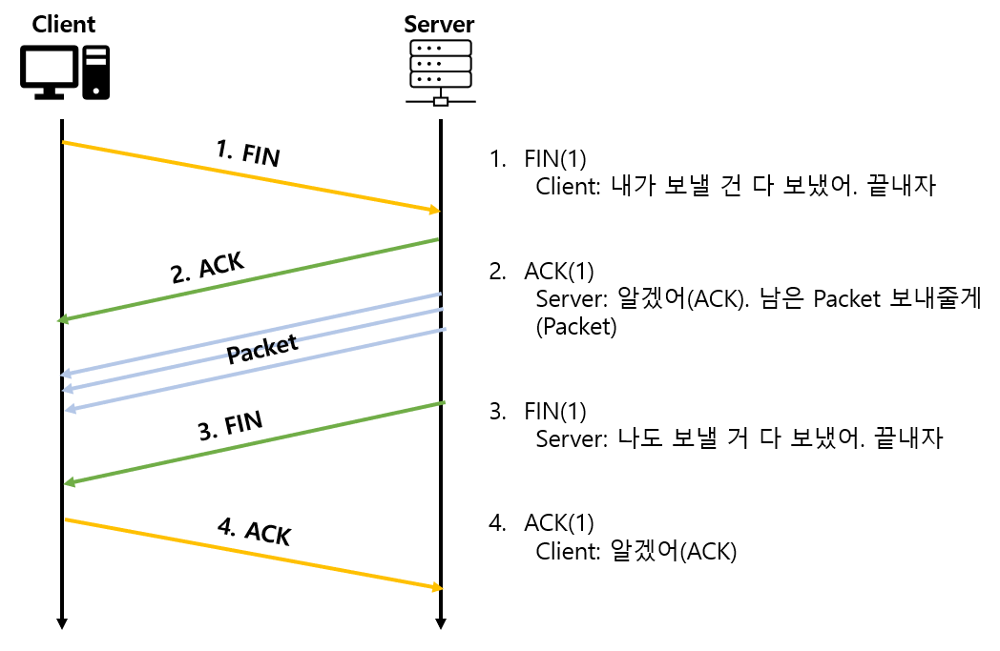

 

## 3. TCP 제어방법 ⭐⭐⭐

TCP의 가장 큰 특징인, 데이터 신뢰성을 보장하기 위한 제어 방법

크게 흐름제어, 혼잡제어, 오류제어로 나뉨

1️⃣흐름제어

데이터 송신부와 수신부에서 데이터 처리 속도의 차이 때문에 생기는 데이터 손실을 방지하는 방법

1. 정지 대기(stop-wait)

송신부에서 데이터를 보낸 후, ACK 메시지를 받을 때까지 다음 데이터를 보내지 않고 기다리는 방식

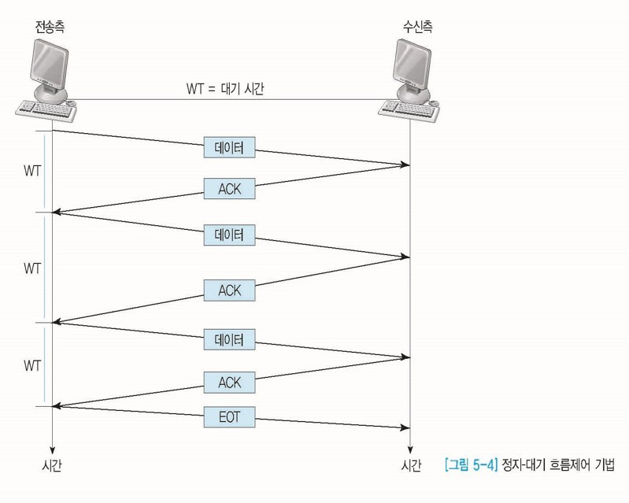

2. 슬라이딩 윈도우

송신부에서 데이터의 수신 여부(ACK)를 확인하지 않고, 수신부에서 설정한 윈도우 크기만큼 데이터를 연속적으로 보낼 수 있게 해서 데이터 흐름을 동적으로 제어하는 방식

수신 여부와 상관없이 일정 크기의 데이터를 연속적으로 보내서 ACK 메시지를 받아야만 다음 메시지를 보낼 수 있는 정지-대기 방식의 단점을 보완

윈도우 크기가 5일 때, 슬라이딩 윈도우는 다음과 같이 동작한다.
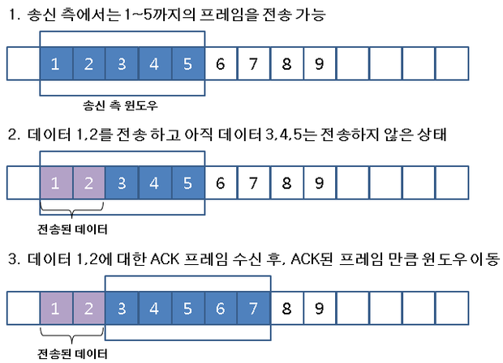

2️⃣혼잡제어

송신부의 데이터 전달 속도와 네트워크 속도 차이로 데이터 손실이 발생하는 것을 방지하기 위한 방법

혼잡은 네트워크에 패킷 수가 과도하게 증가하는 증상을 말함

1. AIMD (Addiive Increase Multiplicative Decrease)

데이터를 전달할 때 합 증가(AI) 방식으로 혼잡 윈도우의 크기를 더해가면서 키움

그리고 데이터 손실이 발생하면 혼잡 윈도우의 크기를 곱 감소(MD) 방식을 적용해 1/2배와 같이 배수 단위로 줄임

2. 느린 시작

위노우 크기가 1인 상태에서 시작해 ACK 메시지를 수신할 때마다 윈도우 크기를 1씩 늘려나감

그러다 혼잡이 발생하면 윈도우 크기를 1로 확 줄이는 방식

3. 혼잡 회피

윈도우 크기가 지수 함수 형태로 증가하다가 혼잡이 발생하는 것을 방지하기 위해 윈도우 크기에 대한 임계점을 정하는 방식

4. 빠른 회복

혼잡이 발생하면 혼잡 윈도우 크기를 절반으로 줄인 후 선형적으로 증가하는 방식

즉, 혼잡이 처음 발생하면 AIMD 방식으로 동작

5. 빠른 재전송

Duplicate ACK가 3번 발생하면 해당 시점의 윈도우 크기를 1/2로 줄이고, ACK 메시지를 받으면 다시 윈도우 크기를 키우는 방식
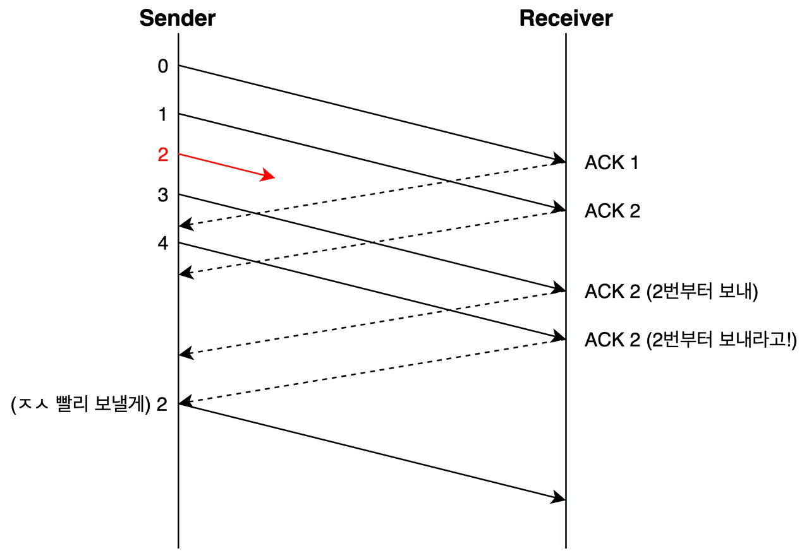

3️⃣오류제어

데이터에 오류 또는 유실이 발생할 때 데이터의 신뢰성을 보장하기 위해 오류를 제어하는 방식

데이터에 오류 또는 유실 발생을 인지하는 경우

- 수신부에서 NAK 메시지를 보낸 경우

- 3 Duplicate ACK가 발생할 때

- 수신부로부터 ACK 메시지를 받지 못해 타임아웃이 발생할 때

1. 정지-대기

송신한 패킷에 대한 ACK 메시지를 일정 시간 동안 받지 못해 타임아웃이 발생하면 해당 패킷을 다시 보내는 방식

송신부에서 데이터를 1개만 보내고 메시지를 기다려야 하기 때문에 ARQ(재전송 요청) 방식 사용

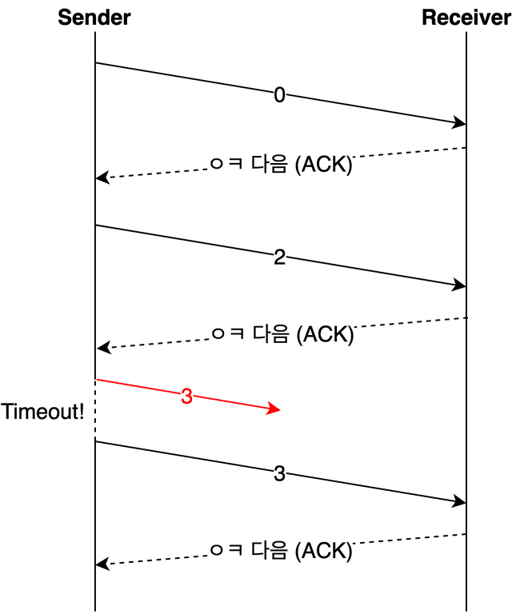

2. Go-Back-N ARQ

송신부에서 연속적으로 데이터를 보냈을 때 누락된 데이터가 있으면 송신부에서 해당 데이터부터 재전송하는 방식

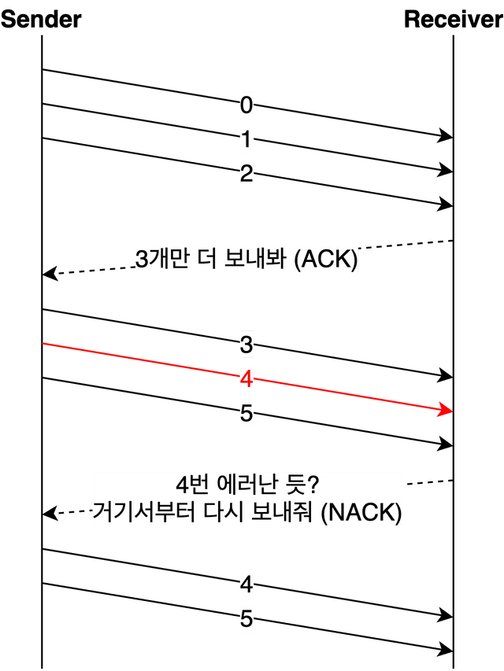

3. Selective-Request ARQ

송신부에서 연속적으로 데이터를 보냈을 때 누락된 데이터가 있으면 수신부에서 해당 데이터만 재전송을 요청하는 방식

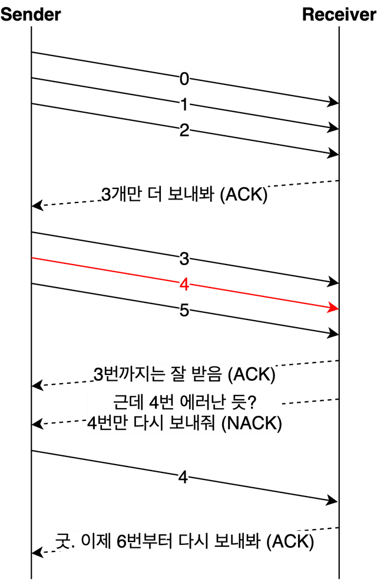

 

## 4. UDP ⭐⭐⭐

TCP와 달리 핸드셰이킹 과정 없이 패킷을 바로 송수신함

- 송신부와 수신부의 연결이 보장되지 않는 비연결형 서비스

- 패킷이 서로 다른 회선으로 교환될 수 있는 데이터그램 패킷 교환 방식

- 패킷 수신 여부를 확인하지 않음

- 1:1, 1:N, N:N 통신 모두 가능

- 데이터의 신뢰성이 낮음

- 데이터의 전송 속도 빠름

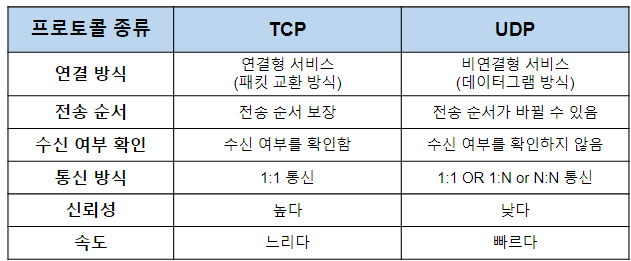

 

## 5. UDP의 오류 검출 ⭐⭐⭐

최소한의 신뢰성을 보장하기 위해 CheckSum 방식으로 오류 검출

❓ CheckSum

데이터의 무결성을 보장하는 간단한 방법

체크섬을 만들기 위한 데이터를 모두 더한다.

오버플로 되는 캐리가 발생하면 해당 캐리를 떼서 데이터에 다시 더한 후 1의 보수를 취해 체크섬을 만든다.
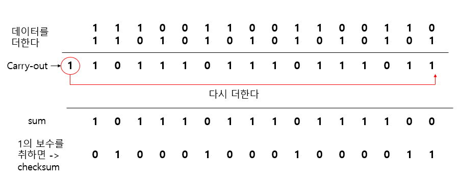
