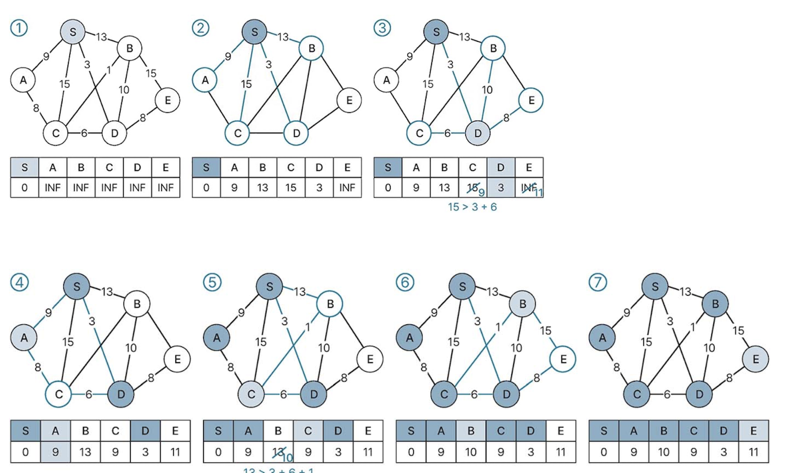
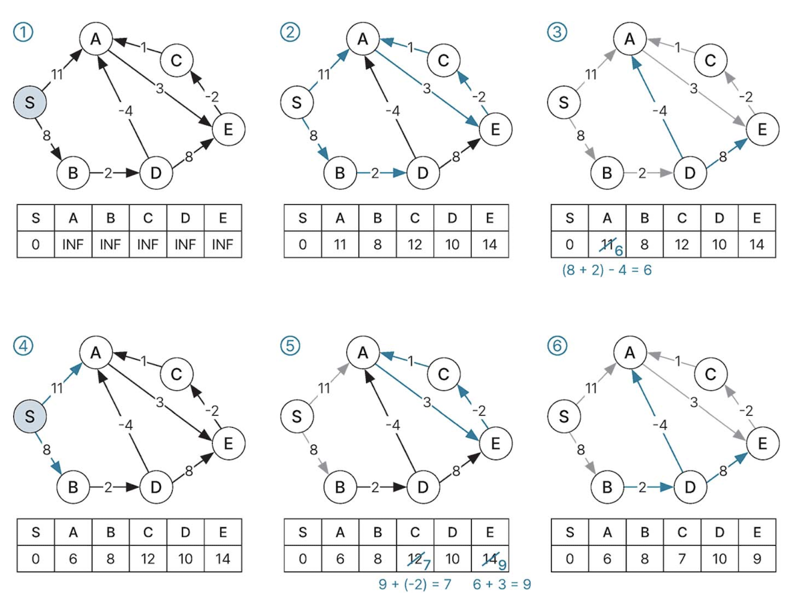
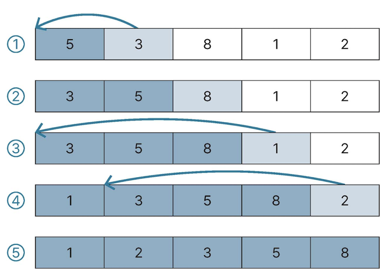

# 5.1 정렬 알고리즘
*주요 keyword: 시간 복잡도, 방식 

### 정렬 알고리즘 종류
- 비교하는 정렬 알고리즘 - 버블, __선택__, 삽입, 합병, 힙, __퀵 정렬__ 등
- 비교하지 않는 정렬 알고리즘 - 계수, 기수 정렬 등

|종류|특징|평균 시간복잡도|
|------|---|---|
|버블 정렬|**인접한 두 수**를 비교해 정렬|O(n^2)|
|선택 정렬|정렬되지 않은 배열에서 **최솟값**을 선택해 정렬|O(n^2)|
|삽입 정렬|정렬된 배열에 탐색중인 요소 삽입|O(n^2)|
|합병 정렬|- 분할 정복 기반 알고리즘 </br> - 배열을 1 이하 크기로 분할한 후 합병 과정에서 정렬|O(nlogn)|
|퀵 정렬|- 분할 정복 기반 알고리즘 </br> - 피봇을 선택해 피봇보다 작은 수의 배열과 피봇보다 큰 수의 배열로 분할하며 정렬 </br> - 피봇에 따라 시간복잡도가 달라질 수 있음|O(nlogn) </br> 최대 O(n^2)|
|힙 정렬|- 힙 기반 정렬 알고리즘 </br> - 최대 힙을 이용해 오름차순 정렬, 최소 힙을 이용해 내림차순 정렬|O(nlogn)|


### 5.1.1 버블 정렬 ★★

버블 정렬은 양 옆에 위치한 두 값을 비교하면서 크기 순으로 정렬합니다.

배열의 첫번째 요소부터 마지막 요소까지 비교하며 정렬했을 때 최댓값은 마지막에 위치합니다. 즉, 첫번째부터 n번째 요소까지 오름차순으로 버블 정렬을 수행하면 비교, 교환을 하며 n-1번을 비교하기 때문에 모든 요소를 정렬하려면 n(n-1)/2만큼 연산을 수행해야되고, 따라서 시간 복잡도가 O(n^2)이 됩니다. 다른 정렬에 비해 느린편이지만 별도의 메모리 공간이 필요하지 않습니다.


```java
static void bubbleSort(int[] a, int n) {
    for(int i=0; i < n-1; i++) {
        for(int j=n-1; j>i; j--) {
            if(a[j-1] > a[j]) {
                int t = a[j-1];
                a[j-1]=a[j];
                a[j]=t;
            }
        }
    }
}
```


### 5.1.2 선택 정렬 ★★

선택 정렬은 아직 정렬하지 않은 부분에서 값이 가장 작은 요소를 선택하고 정렬하지 않은 부분의 첫번째 요소와 교환합니다.

구현 과정 
> 1. 가장 작은 키값(a[min]) 선택 
> 2. a[min]과 정렬되지 않은 부분의 첫번째 요소와 교환 



배열을 순회하면서 배열의 맨 앞에서부터 차례대로 각 인덱스에 들어갈 값을 선택해 위치시킵니다. 배열의 크기를 n이라고 할 때, 각 인덱스 i에 들어갈 숫자를 찾기 위해 n-i개의 값을 비교합니다. 따라서 배열 전체에 대한 정렬을 완료하려면 n(n-1)/2번 연산을 수행하므로 O(n^2)의 시간복잡도가 됩니다.


```java
static void selectionSort(int[] a, int n) {
    for (int i = 0; i < n-1; i++) {
        int min = i;
        for(int j = i+1; j < n; j++) {
            if(a[j] < a[min]) 
                min=j;
            swap(a,i,min);
        }
    }
}
```


### 5.1.3 삽입 정렬 ★★

배열을 앞에서부터 순회하면서 정렬된 부분의 적절한 위치에 값을 삽입하는 방식입니다. 마찬가지로 최대 n-i번 탐색하여 시간복잡도는 O(n^2)이 됩니다.

```java
static void InsertionSort(int[] a, int n) {
    for (int i = 1; i < n; i++) {
        int j;
        int tmp = a[i];
        for(int j = i; j > 0 a[j-1] > tmp; j--) {
            a[j]=a[j-1];            
        }
        a[j]=tmp;
    }
}
```

---

### * 분할 정복 알고리즘 (Divide and conquer algorithm)
해결하기 어려운 문제를 작은 문제로 분할해 해결하는 방식. 주로 **재귀 함수**로 구현
1) [Divide] 원래 문제가 분할하며 비슷한 유형의 더 작은 하위 문제로 분할이 가능할 때까지 나눈다.

2) [Conquer] 각 하위 문제를 재귀적으로 해결한다. 하위 문제를 규모가 나눌 수 없는 단위가 되면 탈출 조건을 설정하고 해결한다.

3) [Combine] Conquer한 문제들을 통합하여 원래 문제의 답을 얻어 해결한다.

대표적으로 합병 정렬, 퀵 정렬, 이진탐색, 선택문제, 고속 푸리에변환(FFT) 문제가 있다.

### 5.1.4 합병 정렬 ★★★

**합병 정렬은 배열을 앞부분과 뒷부분으로 나눠 각각 정렬한 다음 병합하는 작업을 반복하여 정렬**하는 알고리즘입니다. 

재귀를 이용하는 분할 정복 알고리즘이고, 분할은 배열을 쪼개는 것이고, 정복은 분할한 배열을 정렬하면서 하나로 합병하는 것을 의미합니다.

구현 과정 
>1) 정렬하려는 배열의 크기가 0 또는 1이 될 때까지 절반씩 분할 
>2) 분할된 각각의 배열은 다시 하나의 배열로 합쳐지면서 정렬을 수행

배열이 정렬되는 데 걸리는 시간 복잡도가 O(n)이고, 분할 또는 합병 시 걸리는 시간 복잡도는 O(logn)으로 총 O(nlogn)이 소요 됩니다. 

<p align="center">1) 분할과정</p> 


<p align="center">2) 합병과정</p>  

  


### 5.1.5 퀵 정렬 ★★★
퀵 정렬은 가장 빠른 정렬 알고리즘 중 하나로 널리 사용되고 있습니다.

배열에서 피벗(pivot)이라는 특정 값을 선택해서 피봇보다 작은 값, 큰 값으로 구성된 배열로 분할하여 정렬하는 방식입니다.

배열을 두 그룹으로 분할하기 위해 피벗과 pl, pr을 설정해줍니다. 

구현 과정

> 1. 피벗 설정 (어떤 값을 선택하냐에 따라 성능이 좌우됨)
> 2. pl, pr 변수 설정 
> 3. pl은 배열의 첫번째 요소로 시작해 오른쪽으로 한칸씩 이동
    -> 피벗보다 큰 수일 때 멈춤
> 4. pr은 배열의 마지막 요소로 시작해 왼쪽으로 한칸씩 이동
    -> 피벗보다 작은 수일 때 멈춤 
> 5. 멈춘 수에서 pl과 pr의 위치를 교환
> 6. 진행하다가 pr pl (엇갈림) 순서가 되면 정렬을 멈춤


``` java
static void parition(int[] a, int n) {
    int pl = 0 ;
    int pr = n-1;
    int pivot = a[n/2];

    do { 
        while(a[pl] < x) pl++;
        while(a[pr] > x) pr--;
        if(pl <= pr) {
            swap(a, pl++, pr--);
        }
    } while (pl <= pr);
}
```

---

### 5.1.6 힙 정렬 ★★★
힙 정렬은 **트리**를 이용한 알고리즘으로 힙의 특성을 이용하여 정렬합니다.

힙(heap)은 우선순위 큐에서만 주로 사용되는 자료구조입니다.

힙 정렬이 되기 위한 두 가지 조건
1. 완전 이진 트리
2. 최대 힙이나 최소 힙으로 정렬

최대 힙 - '부못값이 자식값보다 항상 크다'라는 조건을 만족하는 완전이진트리

최소 힙 - '자식값이 부못값보다 항상 크다'라는 조건을 만족하는 완전이진트리

구현 과정 (최대 힙으로 정렬을 구현한 과정)
>1. 정렬해야 할 요소들로 최대 힙(완전 이진 트리 형태)을 만듬.

>2. 한번에 하나씩 요소를 힙에서 꺼내 배열의 뒤부터 저장
>3. 삭제되는 요소들(최댓값부터 삭제)은 값이 감소되는 순서로 정렬되게 됨.


<hr/>

# 면접 예상 질문
### Q1. 합병 정렬 알고리즘과 퀵 정렬 알고리즘을 비교해서 설명해주세요.

A1. 합병 정렬 알고리즘과 퀵 정렬 모두 분할 정복 기반 알고리즘입니다. 

합병 정렬은 배열의 크기가 1이하가 될 때까지 분할한 뒤에 배열을 다시 병합하면서 정렬을 진행시킵니다.

퀵 정렬은 배열 중에 피봇을 하나 설정하여 피봇을 기준으로 왼쪽에는 피봇보다 작은 숫자, 오른쪽에는 피봇보다 큰 숫자를 둬서 두개의 배열로 나눕니다. 나뉜 배열에서 값을 하나씩 선택하여 피봇과 비교하며 정렬 및 분할을 수행한 뒤에 합병합니다. 

합병 정렬은 쪼재긴 배열이 합쳐지면서 정렬을 수행하고 추가 메모리가 필요합니다. 반면에 퀵 정렬은 정렬 기준이 되는 숫자인 피봇을 사용해 정렬을 수행하면서 분할하기 때문에 추가 메모리가 필요하지 않습니다.


### Q2. 퀵 정렬 알고리즘에서 발생 가능한 문제점은 어떤 것이 있으며 개선 방법은 무엇인가?

A2. 피봇 값 설정에 따라 성능이 좌우되기 때문에 피봇값을 잘못 선택하게 되면 최악의 시간복잡도(O(n^2))를 가지게 될 수 있습니다. 
이를 개선하는 방법으로는 첫째, 배열의 첫번째나 마지막 요소가 아닌 난수를 피봇으로 설정하는 방법이 있습니다. 이럴 경우 피봇이 배열에서 가장 작은 수나 가장 큰 수로 선택할 확률이 낮아집니다. 이럴 경우 평균적으로 O(nlog2n)의 시간 복잡도를 유지합니다.

둘째, 배열의 첫번째 요소, 중간요소, 마지막 요소 를 뽑아 정렬을 시킨 후 중간 값을 피봇으로 선택하는 방법이 있습니다. 중간 값을 가장 좌측 또는 우측으로 이동시켜서 피봇으로 설정합니다. 이 값이 피벗으로 사용되어 전체 배열을 균등하게 분할한다는 보장은 없지만, 최소한 이 값이 전체 값 중 최대/최소 값에는 해당되지 않는다는 것을 보장하기 때문에 평균 O(nlog2n)의 시간 복잡도를 가질 수 있습니다. 

arr = [35, 33, 42, 10, 14, 19, 27, 44, 26, 31]

예를 들어 다음과 같은 배열이 있을 때 left는 35, mid는 14, right는 31인데 정렬을 하게 되면 right 값인 31이 중간값이 되어 피봇으로 사용한다는 개념입니다. 