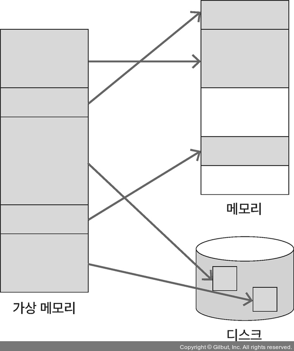
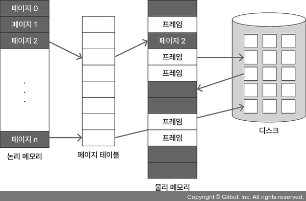
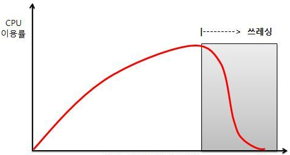

## 1. 가상 메모리란 ⭐⭐⭐

프로세스의 일부만 메모리에 로드하고,  
나머지는 디스크에 둔 상태로 프로세스르 실행하는 방식

- 프로그램이 메모리 크기에 대한 제약을 덜 받을 수 있음
- 동시에 많은 프로그램을 실행하므로 CPU 이용률과 처리율을 높일 수 있음
- 필요한 영역만 메모리에 로드해 스와핑 횟수를 줄여서 프로그램 실행 속도를 높일 수 있음

 

## 2. 요구 페이징 ⭐⭐⭐

프로세스에서 필요한 페이지만 메모리에 로드하는 방식  
필요한 페이지를 물리 메모리에 로드하고, 필요하지 않은 페이지는 디스크에 저장

- <b>페이지 폴트</b>  
  프로그램을 실행하다가 물리 메모리에 필요한 페이지가 없을 때  
  페이지 폴트가 발생하면 디스크에서 필요한 페이지를 스왑인함

- <b>페이지 테이블</b>
  페이지에 해당 메모리 영역이 물리 메모리에 있는지 페이지 테이블로 파악 가능  
  v(valid): 페이지에 해당하는 프레임이 존재  
  i(invalid): 페이지에 해당하는 프레임이 존재x 유효x

 

## 3. 스레싱 ⭐⭐⭐

동시에 일정 수 이상의 프로그램을 실행했을 때 오히려 CPU 이용률이 떨어지는 상황  
다중 프로그래밍 정도가 일정 수준 이상 높아지면 페이징이 빈번히 일어나게 되고 실질적으로 CPU 이용률이 떨어지는 스레싱 발생

