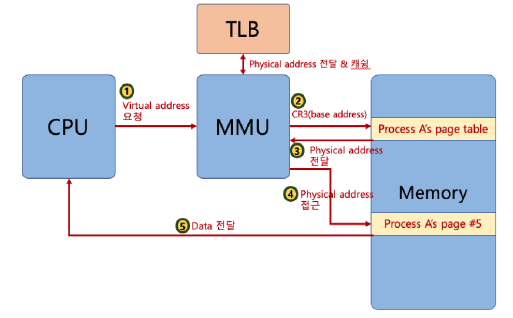
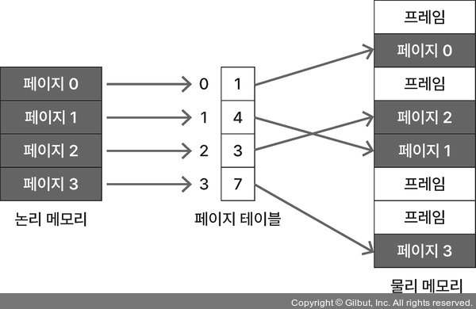
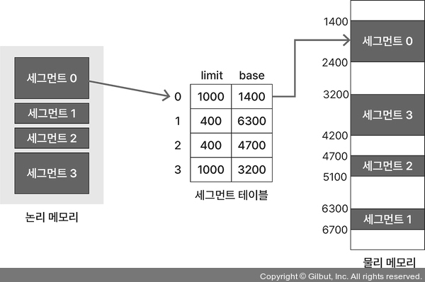

## 1. 논리 메모리와 물리 메모리 ⭐

CPU가 프로세스를 처리할 때 보는 주소 값과 실제 메모리의 주소 값은 다름

논리(가상) 메모리 영역: 프로세스가 보는 메모리 영역  
물리 메모리 영역: 실제로 사용되는 메모리 영역(RAM)

논리(가상) 주소: CPU가 프로세스를 실행하며 보는 주소 값  
물리 주소: 실제 메모리에서 사용되는 주소

- <b>메모리 관리 장치</b> (MMU, Memory Management Unit)  
  CPU가 프로세스를 실행할 때 사용하는 주소 값과 실제 주소 값이 다르기 때문에 논리 주소를 물리 주소로 변환을 해주는 하드웨어 장치

  

 

## 2. 연속 메모리 할당 ⭐

### 고정 분할 방식

메모리 영역을 분할한 뒤 각 영역에 프로세스를 할당하는 방식

단점)  
메모리에 올릴 수 있는 프로세스 수와 각 프로세스의 크기가 제한  
단편화 문제가 발생할 수 있음 ex) 내부 단편화, 외부 단편화

### 가변 분할 방식

할당할 프로세스의 크기에 따라 메모리 공간을 분할하는 방식

- 최초 적합 (first-fit)  
  가용 메모리 공간에서 프로세스 크기만큼 비어 있는 메모리 공간을 찾아 차례대로 프로세스를 로드하는 방식

- 최적 적합 (best-fit)  
  할당하려는 프로세스 크기 이상인 가용 메모리 공간 중에서 가장 작은 공간에 프로세스를 할당하는 방식

- 최악 적합 (worst-fit)  
  할당하려는 프로세스 크기보다 큰 가용 메모리 공간 중에서 가장 큰 공간에 프로세스를 할당하는 방식

 

## 3. 비연속 메모리 할당 ⭐⭐⭐

### 페이징

프로세스의 논리 메모리 영역과 물리 메모리 영역을  
각각 일정한 크기의 <b>페이지</b>와 <b>프레임</b>으로 나눔

- <b>페이지 테이블</b>  
  페이지와 프레임을 매핑하는 곳
  페이지 테이블은 각 프로세스의 PCB에 저장됨

  

### 세그먼테이션

프로세스의 메모리 영역을 논리적 단위인 세그먼트로 분할해 메모리 할당

- <b>세그먼테이션 테이블</b>  
  세그먼트의 논리 주소를 물리 주소로 매핑

  
