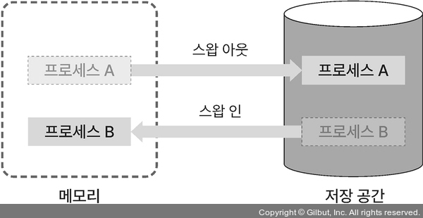

## 1. 스케줄링의 목적 ⭐

멀티 프로세스 환경에서 모든 프로세스를 공평하게 실행하기 위해

 

## 2. 스케줄링의 단계 ⭐⭐⭐

- <b>장기 스케줄링</b>  
  준비 큐에 어떤 프로세스를 넣을지 결정해 메모리에 올라가는 프로세스 수를 조절  
  잡 스케줄링 or 승인 스케줄링이라고도 함

- <b>중기 스케줄링</b>  
  메모리에 로드된 프로세스 수를 동적으로 조절  
  메모리에 프로세스가 많이 로드되면 <b>스왑 아웃</b>해서 일부 프로세스를 통째로 저장  
  스왑 아웃된 프로세스는 <b>중단 상태</b>가 됨

  

- <b>단기 스케줄링</b>  
  준비 큐에 있는 대기 상태 프로세스 중 어떤 프로세스를 다음으로 실행할지 스케줄링 알고리즘으로 결정  
  즉, 어떤 프로세스를 디스패치할지 결정하는데 이를 <b>CPU 스케줄링</b>이라고 함

 

## 3. 스케줄링 알고리즘 ⭐⭐⭐

CPU 스케줄러가 준비 큐에 있는 프로세스 중 어떤 프로세스를 실행시킬지 결정하는 데 사용

### 비선점형 스케줄링

실행 중인 프로세스가 종료될 때까지 다른 프로세스를 실행할 수 없음

- <b>FCFS 스케줄링</b> (First Come First Served)  
  준비 큐에 먼저 들어온 프로세스가 우선순위를 갖는 알고리즘

- <b>SJF 스케줄링</b> (Shortest Job First)  
  실행 시간이 짧은 프로세스가 우선순위를 갖는 알고리즘

### 선점형 스케줄링

스케줄러가 실행 중인 프로세스를 중단시키고 다른 프로세스를 실행할 수 있음

- <b>RR 스케줄링</b> (Round Robin)  
  비선점형 스케줄링과 달리 프로세스간 우선순위 없음  
  모든 프로세스를 순서대로 일정 시간 동안 실행하며, 일정 시간을 초과하면 다른 프로세스를 실행

- <b>SRTF 스케줄링</b> (Shortest Remaining Time First)  
  준비 큐에서 대기 시간이 가장 짧게 남은 프로세스를 우선 수행하는 알고리즘  
  한 프로세스가 실행 중일 때 실행 시간이 더 짧은 프로세스가 준비 큐에 들어오면 실행 시간이 더 짧은 프로세스가 CPU를 차지하게 됨. 평균 대기 시간이 짧다는 장점이 있지만, 수행 시간이 긴 프로세스는 기아 상태가 되기 쉬움

- <b>멀티 레벨 스케줄링</b> (multi level)  
  준비 큐를 목적에 따라 여러 개로 분리해 사용하는 알고리즘  
  분리한 큐는 각각 우선순위가 있고 각자 다른 스케줄링 알고리즘 적용 가능
