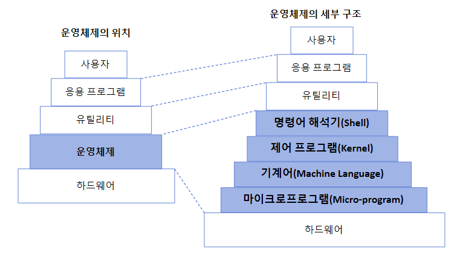
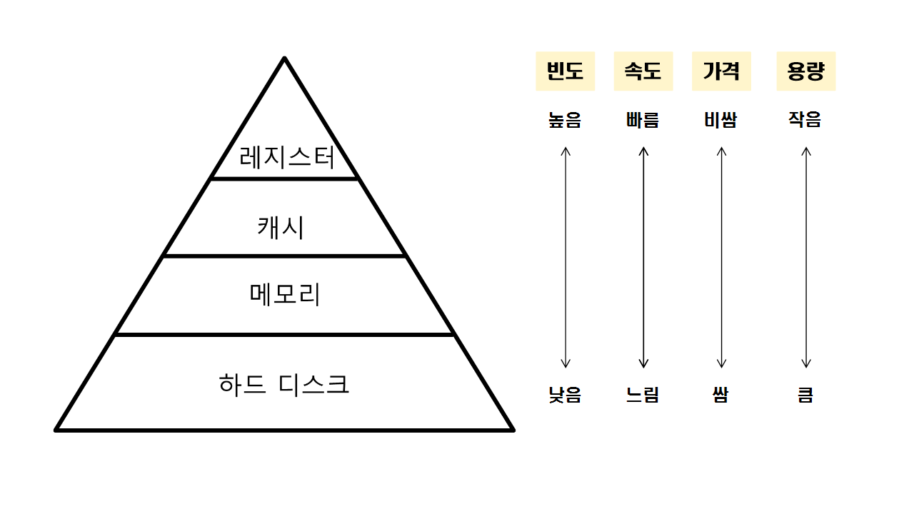
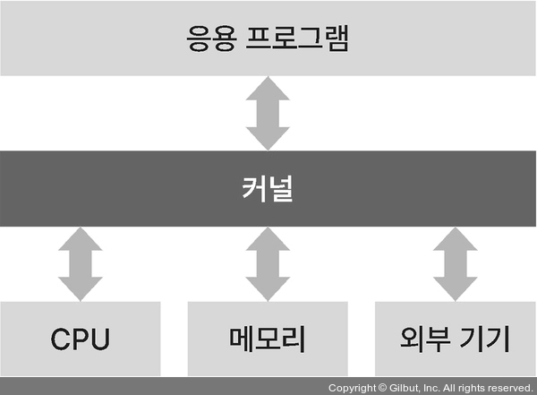

## 1. 운영체제란 ⭐

하드웨어 위에 설치되어 하드웨어 계층과 다른 소프트웨어 계층을 연결하는 소프트웨어 계층  
 컴퓨터 시스템의 자원을 관리하고, 사용자가 컴퓨터를 사용할 수 있는 환경을 제공

 

## 2. 운영체제의 목적 ⭐

1. <b>처리 능력 향상</b>  
   자원 관리를 통해 일정 시간 내에 시스템이 처리하는 일의 양을 향상시킴
2. <b>반환 시간 단축</b>  
   사용자가 시스템에 요청한 작업을 완료할 때까지 소요되는 시간 단축시킴
3. <b>사용 가능도 향상</b>  
   사용자가 컴퓨터를 사용해야 할 때 자원을 즉시 사용할 수 있게 함  
   사용 가능도? 시스템 자원을 얼마나 빨리 제공할 수 있는가
4. <b>신뢰도 향상</b>  
   입력 값에 대한 정확한 결과 값을 줄 수 있도록  
   신뢰도? 시스템이 주어진 문제를 정확하게 푸는지

 

## 3. CPU와 메모리 구조 ⭐⭐

### CPU (Central Processing Unit, 중앙 처리 장치)

컴퓨터의 뇌 역할, 컴퓨터에서 프로그램을 실행하는 데 필요한 연산 수행  
<b>프로세서(Processor)</b>라고도 함

### 메모리

데이터를 저장하기 위한 기억장치

    주기억장치(메인메모리) - 휘발성 메모리 ex) RAM
    보조기억장치 - 비휘발성 메모리 ex) SSD, HDD

메모리 계층 구조  

- <b>레지스터</b>  
  CPU가 사용자 요청을 처리하는 데 필요한 데이터를 임시로 저장하는 기억장치  
  CPU 내부에 존재하며 접근 속도 빠름
- <b>캐시메모리</b>  
  CPU와 RAM 사이의 속도 차이를 해결하기 위한 기억장치  
  CPU 내부에 존재하며 접근 속도가 레지스터 다음으로 빠름
- <b>RAM</b>  
  컴퓨터에서 프로그램을 실행할 때 필요한 정보 저장  
  CPU에서 접근 속도가 하드 디스크보다 빠르고, 휘발성 기억장치  
  보통 메모리라고 할 때 RAM을 의미
- <b>하드 디스크</b>  
  사용자가 필요한 데이터와 프로그램 저장, 비휘발성 메모리

 

## 4. 커널과 시스템 콜 ⭐⭐⭐

### 커널 (Kernel)

OS의 핵심 요소  
컴퓨터 하드웨어와 프로세스의 보안, 자원 관리, 하드웨어 추상화 같은 중요한 역할 수행  
자원 관리를 위해 CPU 스케줄링, 메모리 관리, 입출력 관리, 파일 시스템 관리 등 담당

- <b>커널 모드</b>  
  중요 자원에 사용자가 쉽게 접근하지 못하도록 하는 모드  
  <u>하드웨어에 직접 접근</u>해 메모리, CPU와 같은 자원 사용 가능
- <b>사용자 모드</b>  
  커널 모드의 자원에 접근할 수 없게 제한을 둠

사용자 모드에서 실행된 프로세스가 자원에 접근하려면 시스템 콜을 호출해 커널에 요청해야함  
커널은 시스템 콜로 받은 요청을 처리한 후 다시 시스템 콜로 결과 값을 반환함

<b>시스템 콜</b>이란?  
사용자 모드에서 커널 모드에 접근해 필요한 기능을 수행할 수 있게 하는 시스템 함수  
프로세스 제어, 파일 조작, 장치 관리, 데이터 유지 보수, 통신, 보호 할 수 있음

    - 시스템 콜 대표적 예시
    프로세스를 생성하는 fork()
    부모 프로세스가 자식 프로세스의 수행을 기다리는 wait()
