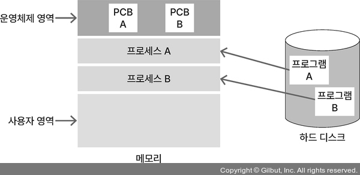
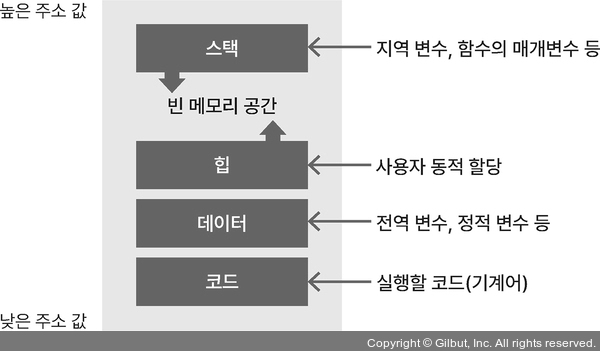
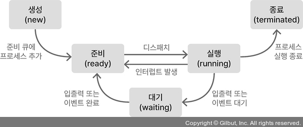
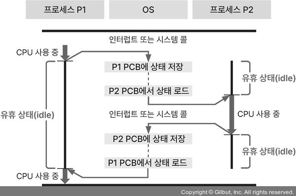

## 1. 프로세스와 스레드 ⭐⭐⭐

### 프로세스 (Process)

컴퓨터에서 실행 중인 하나의 프로그램 의미  
<b>PCB(Process Control Block)</b> 프로세스 제어 블록

프로세스에 할당된 메모리 영역  


프로세스의 메모리 영역 구조  


스택 영역: LIFO(후입선출)  
힙 영역: FIFO(선입선출)

메모리 영역을 공유하기 때문에 서로의 영역을 침범하는 문제 생길 수 있음

- <b>스택 오버플로</b> (스택 영역이 힙 영역 침범)
- <b>힙 오버플로</b> (힙 영역이 스택 영역 침범)

### 스레드 (Thread)

프로세스는 한 개 이상의 스레드 가짐  
프로세스에서 실제로 실행되는 흐름의 단위  
프로세스 안에 존재하므로 프로세스의 메모리 공간 이용  
지역 변수를 저장하는 스택 영역 할당받음  
전역 변수를 저장하는 힙 영역은 다른 스레드와 공유

<br>

## 2. PCB(Process Control Block) ⭐⭐

프로세스를 제어하기 위해 프로세스 정보 저장  
프로세스 현재 상태, 프로세스를 나타내는 고유의 PID, 부모 프로세스 PID, 자식 프로세스 PID, 다음 실행할 명령어의 주소 PC(Program Counter), 프로세스 우선순위, 메모리 제한 등을 저장

<br>

## 3. 프로세스의 생성 ⭐⭐⭐

부모 프로세스에서 <b>fork()</b> 함수를 호출하면 부모 프로세스는 자식 프로세스의 PID 값을, 자식 프로세스는 0을 반환


<br>

## 4. 프로세스 상태도 ⭐⭐⭐

모든 프로세스는 CPU에 의해 생성되고 소멸하는 과정 거침

- <b>생성</b>: 프로세스가 PCB를 가지고 있지만, OS로부터 승인 받기 전
- <b>준비</b>: OS로부터 승인받은 후 준비 큐에서 CPU 할당 기다림
- <b>실행</b>: 프로세스가 CPU를 할당받아 실행함
- <b>대기</b>: 프로세스가 입출력이나 이벤트 발생을 기다려야 해서 CPU 사용을 멈추고 기다림
- <b>종료</b>: 프로세스 실행을 종료함



<br>

## 5. 멀티 프로세스와 멀티 스레드 ⭐⭐⭐

- 동시성  
  하나의 코어(싱글 코어)에서 여러 작업을 번갈아 가면서 처리하는 방식, CPU는 하나의 작업만 처리할 수 있어서 여러 작업을 번갈아 처리하는데 이를 콘텍스트 스위칭이라고 함

- 병렬성  
  CPU가 여러 개(멀티 코어)있어서 각 CPU에서 각 작업을 동시에 처리하는 방식

### 멀티 프로세스

응용 프로그램 하나를 여러 프로세스로 구성하는 것

    장점) 한 프로세스가 죽어도 다른 프로세스에 영향 x
    단점) 시간과 메모리 공간을 많이 사용함(오버헤드)
          여러 프로세스를 처리하려면 콘텍스트 스위칭 작업 필요

프로세스는 독립적인 메모리 할당받음  
따라서, 공유할 자원이 있다면 IPC(Inter Process Communication)를 통해 프로세스 간 자원 공유  
공유할 메모리 직접 참조하는 것보다 비효율적

### 멀티 스레드

스레드를 여러 개 생성해 스레드들이 각자 다른 작업을 처리하는 것  
스레드 간에 힙, 데이터, 코드 영역을 공유

    장점) 콘텍스트 스위칭할 때 오버헤드가 적게 발생하고 IPC 사용 x
          프로세스 여러개 생성 < 스레드 여러개 생성 자원 효율적
    단점) 스택 영역을 다른 스레드와 함께 사용하므로 공유 자원에 대한 동기화 필수
          스레드에 문제가 생기면 프로세스 내 다른 스레드에 영향을 미칠 수 있음

<br>

## 6. 콘텍스트 스위칭 (Context Switching)⭐⭐⭐

멀티 프로세스 환경에서 CPU가 처리 중인 프로세스의 정보를 바꾸는 것

CPU는 하나의 프로세스만 처리 가능하기 때문에 멀티 프로세스를 처리하려면 CPU 스케줄러에 의해 인터럽트가 발생하며 콘텍스트 스위칭이 일어남

- 인터럽트  
  입출력 관련 이벤트가 발생하거나 예외 상황이 발생할 때 이에 대응할 수 있게 CPU에 처리를 요청하는 것

- 콘텍스트  
  CPU가 처리하는 프로세스의 정보를 의미

❓ CPU에서 처리 중인 프로세스가 중간에 변경되어도 이전에 실행하던 코드를 이어서 실행할 수 있는 이유  
<u>PCB에 프로그램 카운터와 스택 포인터 값이 저장</u>되어 있기 때문

- 프로그램 카운터(PC, Program Counter)  
  프로세스가 이어서 처리해야 하는 명령어의 주소

- 스택 포인터(Stack Pointer)  
  스택 영역에서 데이터가 채워진 가장 높은 주소 값



<br>

## 7. 프로세스 동기화 ⭐⭐⭐

- 경쟁상태  
  공유 자원에 동시에 접근해 경쟁하는 상태

- 임계영역  
  공유 자원에 접근할 수 있고 접근 순서에 따라 결과가 달라지는 코드 영역

- 프로세스 동기화  
  임계 영역에서 경쟁 상태가 발생하는 것을 방지하려면 여러 프로세스가 공유 자원에 접근해도 데이터의 일관성이 유지되도록 동기화해야함

### 임계영역 동시에 여러 접근 방지하는 3가지 조건

    - 상호 배제 기법
    어떤 프로세스가 임계 영역을 실행 중일 때 다른 프로세스가 임계 영역에 접근할 수 없음 ex) 뮤텍스, 세마포어

    - 진행
    임계 영역을 실행 중인 프로세스가 없을 때 다른 프로세스가 임계 영역을 실행

    - 한정된 대기
    임계 영역에 접근을 요청했을 때 무한한 시간 기다리지 않음

#### 뮤텍스 (mutex)

<b>락(lock)을 가진 프로세스</b>만이 공유 자원에 접근할 수 있게 하는 방법  
임계 영역에 접근한 프로세스가 임계 영역에 락을 건다고 해서 락킹 알고리즘이라고도 함

- 스핀락  
  임계 영역에 접근하지 못한 프로세스는 락을 얻기 위해 기다리는 동안 락이 풀렸는지 반복문 돌면서 기다리는 것

#### 세마포어 (semaphore)

공유 자원에 접근할 수 있는 <b>프로세스의 수</b>를 정해 접근을 제어하는 방법

<br />

## 8. 교착 상태 ⭐⭐⭐

상호 배제 기법 때문에 2개 이상의 프로세스가 각각 자원을 가지고 있으면서 서로의 자원을 요구하며 기다리는 상태

### 교착 상태가 발생하는 4가지 필요충분조건

    - 상호배제
      하나의 공유 자원에 하나의 프로세스만 접근할 수 있음

    - 점유와 대기
      프로세스가 최소 하나의 자원을 점유하고 있는 상태에서 추가로 다른 프로세스에서 사용 중인 자원을 점유하기 위해 대기

    - 비선점
      다른 프로세스에 할당된 자원을 뺏을 수 없음

    - 환형 대기
      프로세스가 자신의 자원을 점유하면서 앞이나 뒤에 있는 프로세스의 자원을 요구

교착 상태를 막으려면 4가지 필요 충분 조건에서 한 가지 제거하면 됨

<br>

## 9. 스레드 안전 ⭐⭐

멀티스레드 환경에서 하나의 변수, 함수, 객체에 스레드 여러 개가 동시에 접근해도 문제가 없는 것

```
var++;
```

var 변수의 값을 메모리에서 CPU 레지스터로  
로드 -> 연산 처리 -> 연산 결과를 메모리에 작성하는 과정 거침  
이 코드에 스레드 2개가 접근하면 잘못된 결과 초래 가능

<br />

## 10. IPC (Inter Process Communication) ⭐⭐

프로세스는 고유한 메모리 영역을 가지고 있기 때문에  
프로세스 간 자원을 공유해야 될 때 IPC 해야됨

- <b>공유메모리</b>  
  프로세스 간에 공유 가능한 메모리를 구성해 자원을 공유하는 방식

- <b>소켓</b>  
  네트워크 소켓을 이용하는 프로세스 간 통신  
  외부 시스템과도 이용 가능, 클라이언트 <-> 서버

- <b>세마포어</b>  
  접근하는 프로세스 수를 제어해 공유자원 관리

- <b>파이프</b>  
  FIFO형태의 메모리인 파이프를 이용해 프로세스 간 자원을 공유하는 방식

- <b>메시지 큐</b>  
  FIFO형태의 큐 자료구조를 사용해 프로세스 간 메세지를 주고받는 방식

<br>

## 11. 좀비 프로세스와 고아 프로세스 ⭐⭐

- <b>좀비 프로세스</b>  
  자식 프로세스가 종료되었지만 부모 프로세스가 자식 프로세스의 종료 상태를 회수하지 않았을 경우에 남겨진 자식 프로세스

- <b>고아 프로세스</b>  
  부모 프로세스가 자식 프로세스보다 먼저 종료되는 경우의 자식 프로세스
